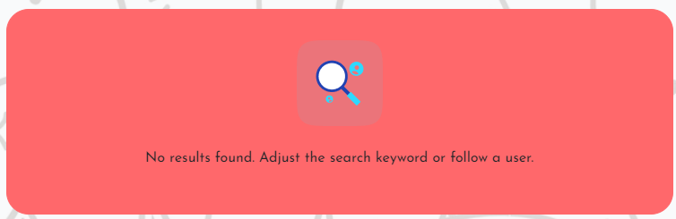

# Cat Snaps

Cat Snaps is a social media application for cat lovers and can be found [here](https://cat-snaps-25d053ae1bdb.herokuapp.com)

## Objective

The objective of this project is to provide a social media app where users can come together to share their love of cats.  Users can either sign up to share their own cat photos or to view other users' photos and interact with them.  The app provides the features you would expect of a social media app - to share photos, like and comment on them, follow users and be followed.

## Project Management

This app was planned using Agile methodology and MoSCoW prioritisation on GitHub Projects.

I created Epics for each feature and broke this down into Sprints, driven by User Stories (as detailed below). Each User story/feature was prioritised as either Must have, Should have, Could have or Won't have. Each task was moved through the kanban as the tasks progressed from To Do, In Progress, to Done.

The Epics can be found [here](https://github.com/ShieldsJohn/cat-snaps/milestones?direction=asc&sort=title&state=open) and the kanban found [here](https://github.com/users/ShieldsJohn/projects/5/views/1).

### API

The back-end functionality of this app is handled by a django rest framework API, designed specifically for this app.  The repository for this can be found [here](https://github.com/ShieldsJohn/drf_ap)

## User Experience (UX)

### User Goals

- To share cute cat photos and brighten up your followers' day.
- To connect with other users, either by interacting with posts or with users directly through following and commenting.
- To have a feeds of favourite posts and posts of followed users.
- To learn about cat breeds and their quirky differences.
- To enjoy using an intuitive and engaging app.

### User Stories

The following are user stories for each of the app features.

### Navigation and Authentication

- As a user, I can view a Navbar from every page so as to easily navigate around the website.
- As a user, I can sign-up to access the full features of the website.
- As a user, I would like to be able to sign in to my previously created account.
- As a signed in user, I'd like to see confirmation of that status and to be able to sign out.

### Posts

- As a user, I can create a post to share with everyone on the website.
- As a user, I want other users to be able to select/deselect reactions to my post and to see a count of reactions given.
- As a user, I would like an option on the navbar to give me access to posts I have reacted to.
- As a user, I am given an option to edit a post, should I need to update or correct it.
- As a user, I can delete my posts to remove them from the site.

### Comments

- As a logged in user, I can add comments to other users posts, so I can communicate with those users about their posts.
- As a logged in user, I would like to be able to edit and/or delete the comments I have posted.

### Profiles

- As a user, I can see the most popular profiles, to view the most popular content.
- As a user, I can view profile pages to view user information.
- As a logged in user, I can edit the information in my profile page.

### Follow

- As a logged in user, I can follow other users so I can see their posts in my feed page.
- As a logged in user, I can unfollow other users to stop seeing their posts in my feed.

### Contact

- As a logged in user, I would like a contact icon in the navbar, which will take me to a contact form that enables me to easily contact Cat Snaps with any issues or suggestions.

## Design

Being a mobile-first responsively designed app, I started with how this app would be optimised for mobile devices.  This dictated the components that would be included and the presentation of them from mobile through to desktop.  For example, the verticle, sequential layout of components for mobile, expanding out horizontally as appropriate for larger screen sizes.  Component elements such as the number of profiles shown in Recommended Profiles, for example, there are four shown on mobile and ten shown on laptops and desktops (although not depicted below due to wireframe limitations).  Responsive design is about ensuring an optimised user experience, no matter the device they are using.

Some of the features have changed since first conception.

### Colour-scheme

Part of the reason for choosing a cat themed app, was to create an app that was aesthetically different to anything I had previously done.  I wanted to create an inviting, cute feeling app.  Therefore, I wanted softer pastel tones, using some primary colours. After some research I settle on the pastel red, blue and green as below.

  

To add to the cuteness, I also wanted a Japanese kawaii-style (INSERT KAWAII LINK) cat background.  I overlaid this with an opaque filter, to ensure it didn't visually interfere with the content.

### Font

In keeping with the cute theme, I searched Google Fonts for something that would enhance the theme.  I settled on Josefin Sans for it's rounded letters which I felt complemented the rounded components, avatars and background image.

### Icons

Icons were obtained from [Font Awesome](https://fontawesome.com).  I chose familiar social media and navbar icons to ensure an intuitive user interface (UI).  I also used a cat icon to accompany the app title in the navbar.

   
  
  
  

## Features

### Navigation

The navbar is visible throughout the app, offering constant access to its features.  It is also responsive and optimised for all devices.  The features availble to the user will depend on if they are signed in or not.  A non-signed in user can still view parts of the app, so as to entice them to sign up, however they cannot interact with most features until they sign up and/or sign in.

Below are screenshots of the navbar and it's features for both signed in and signed out status.

- Signed out

 

- Signed in

### Authentication

Sign up

As mentioned, new users to the app can sign up.  Doing so will create user and profile records in the API database and allow full functionality to the front-end features.  A sign up form has been provided to allow the users to do this, as shown below.

 

Sign in

If a user has previously signed up, they can sign in via a form, found by selecting Sign in, in the navbar.

Sign out

A signed in user can sign out via a similar form, found by selecting Sign out, in the navbar.

Input validation is in place for each of the above forms.  For example, the user must complete each fields and provide a password that meets the requirements.  If not, messages will advise the user what is required.

### Home page

The home page consists of the following components:

- Most Followed Users

This component features across the app. It appears at the top of all pages. It uses a filter to order all site users by followers count from highest to lowest. The users with the highest follower count are the most popular profiles and the top ten are displayed on larger screens, with four displayed on mobile devices.

If the user is not signed in, they can see avatars and usernames of the top ten most popular profiles.  If the user is signed in on a laptop or larger device, they will also see buttons enabling them to follow or unfollow those profiles.

- New Users

This component also features across the app, sitting below the Most Followed Users component.  This also uses a filter to order users by the date they created their profile, with the latest five (four on mobile) users being displayed in the compoment.

Similarly follow/unfollow buttons appear on larger devices.

- Add posts

When a user selects the Add post icon from the navbar, they are taken to the below form.  This form provides an image upload and fields to give the post a title and caption.  When the user selects Create, they are redirected to their new post.  If they select cancel, they are redirected to the home page.

- Posts

When a signed in user creates a post, it is displayed in the main feed on the home page showing the user's name and avatar, the date it was posted, the image, title and caption, reactions and comments.  The user will also be able to edit or delete their post from a dropdown menu on each post.

Users viewing posts by other users can react to the posts, by clicking on one of the reaction icons.  This will change colour to confirm their selection and the count will increase.  The user can also deselect their reaction, so long as it's before their token expires.  When they do this, they will see the reaction count reduce.

Users can also select the comment icon to leave a comment on the post.  This will open a comment field and once the comment is submitted, it will be displayed with the username, avatar and how long ago the comment was posted.  If the user wants to edit or delete the comment, they can do so via the dropdown menu on their comment.  This option will not be available for comments that do not belong to the user.

- Search

Users can use the search bar to search for keywords.  The relevant feed will be filtered by the results found in usernames, post titles and captions.

- Feed

The Feed page found in the navbar is identical to the home page.  However, this returns the posts of users that the signed in user is following.  If the user is not following anyone, the below message will be displayed.

- Likes

The Likes page found in the navbar is identical to the home page.  However, this returns posts where the user has selected like.  If the user has not liked any posts, a similar message to the one above will be displayed.

### Profiles

Profile avatars throughout the app, whether in the Most Followed Users or New Users components, or next to comments can be selected to view the full profile page of that user. Signed in users can also access their own profile page from their avatar in the navbar.

When a user signs up, a standard profile is created with a username, password and default avatar image. Through the user's actions, the profile page will be updated with the following:

- Number of posts
- Number of profiles following
- Number of followers

The user can manually update the rest of their profile page info, such as, avatar, bio and their social media links.  This is done by selecting edit profile from the dropdown menu on their profile page.  A form is proivded for updating all these details together.  In the dropdown, there are also options for the user to change their username or password.

When viewing other users profiles, there will also be a follow/unfollow button for the user's convenience.

### Contact

A contact form is available for signed in users to access from the navbar.  As shown below, the required fields are:

- Name
- Email
- Subject
- Message

If all the fields are not completed, the user will be advised to do so.

Upon successful submition of the form, the user will be presented with a modal confirming.

### Future Features

- Contact - to fully implement the contact feature to enable the sender to see their sent messages and delivered/read status and for the admin to reply.
- Notifications - to notify users of any actions on their posts, new followers and responses from sent contact messages etc
- Direct Messaging - to facilitate deeper social networking between users via a messaging feature.

## Reusable React Components
  
- Asset.js - this displays a spinner wherever a page is loading a component. This has been reused in NotFound.js, PostCreateForm.js, PostPage.js, PostsPage.js, PopularProfiles.js, ProfilePage.js.

- Avatar.js - this provides for handling the Avatar images.  It can be reused where users need to add avatars or images and has been reused in NavBar.js, Comment.js, CommentCreateForm.js, Post.js and Profile.js.

- MoreDropDown.js - this displays an ellipsis, that expands a dropdown menu when selected.  This has been reused in Comment.js, Post.js and ProfilePage.js

## Testing

### Manual Testing

The manual testing below has been carried out to test the features of this app, the functionality of the API and the user experience.

By carrying out the above testing, I can confirm the app and API are working as expected.

### Code Validation

Eslint was used to validate all .jsx files.  Initially there were around 200 errors mostly relating to props validation and apostrophes to be formatted.  This was simple enough to rectify and as a result, all .jsx files are validated, as below.

W3C CSS validator was used to validate all CSS files.  All files passed, an example screenshot below.

### Accessibility

I used Chrome DevTools Lighthouse to test the accessibility of the app.  It achieves a good score of 95, as below.

### Responsiveness

All pages were tested to ensure responsiveness on screen sizes => 320px, by using Chrome's DevTools responsive dimensions.  All pages behaved as expected.

I also tested with an iPhone 14, using both Brave and Safari browsers.  Again, all pages behaved as expected.

I also used www.amiresponsive.com to generate the responsive image and everything was fine on that too.

### Bugs

There were bugs during development which were mostly resolved.  The main outstanding issue is with the profile avatar of the signed in user not being visible on tablet dimensions.  I tried various different settings with the React-Bootstrap layout classes and CSS but the best I could do was have the 'Profile' title there to show the user where to click.

The resolved bugs are as follows:

Deployment issue
- Issue:
Previous deployments were successful, then I started getting this error in Heroku; '[BABEL] /usr/src/app/src/index.js: Cannot find module '@babel/plugin-proposal-private-property-in-object'. Despite the deployment completing successfully.

- Solution:
I searched online for a solution and found that if I moved "@babel/plugin-proposal-private-property-in-object": "^7.21.11" from devDepencies in package.json to Dependencies, this resolved the issue.

Signed in users after sign up

- Issue:
I created the functionality for users to be automatically signed in after successful sign up. However, during testing I found the new user did not have the 'logged in' icons available in the navbar, unless they manually refreshed the browser.

- Solution:
This issue was due to the currentUser state in SignUpForm.js not being updated immediately after the automatic sign in. So I imported useSetCurrentUser from CurrentUserContext to call setCurrentUser(data.user) to update the state with the logged in user's data.

## Technologies

### Languages

- HTML
- CSS
- JavaScript

### Frameworks and other

- React.js
- React-Bootstrap
- Github
- GitPod
- Heroku
- Google Chrome DevTools
- Lighthouse
- Cloudinary 
- Balsamiq 
- Eslint 
- W3C CSS Validation 

## Deployment

This app is deployed and hosted on Heroku. I followed these steps during deployment.

- Select Create new app add unique title and select your region. Selecy Create App.
- Select Settings tab and apply the relevant config VARs
- Select Deploy tab and select Github
- Search for the repository title from the GitHub account
- Select Connect
- Manually Deploy Main Branch
- Upon successful deployment, select Open App to view deployed app.
  
To connect the app to the API:

- Go to the API application settings, in the Heroku dashboard.
- In Settings add a new Config Var called CLIENT_ORIGIN and set that to the URL for the deployed React application.
- Add another Config Var called 'CLIENT_ORIGIN_DEV' and enter the URL of the Gitpod preview link, remembering to remove the trailing slash at the end. Gitpod occasionally changes this URL so keep an eye on it, as you are working on your project.
- Go back to your front-end Gitpod workspace and install the Axios library using the command 'npm install axios'.
- Create a folder called API and inside it create a file called 'axiosDefaults'.
- Import axios at the top of the file and define your baseURL which is the unique URL of your deployed API project. 
- Set the content-type header to multi-part/form-data as the API will need to deal with images as well as text in its requests.
- In order to avoid any CORS issues, set withCredentials to True.
- Import this file into App.js to be used across all pages

Forking the repository in GitHub

To make a unique copy of a GitHub repository by forking, follow these steps:

- Log in to GitHub
- Locate the repository to be forked
- Find the Fork button at the top right-hand side of the page
- Click on the button to create a copy of the original repository

## Media

## Credits

